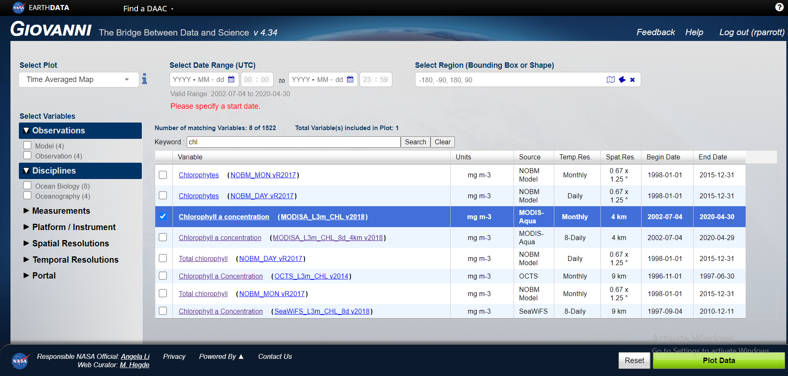

# Plotting satellite ocean colour climatology data in R

Analyses and visualizations used in this tutorial were produced with the [Giovanni online data system](https://giovanni.gsfc.nasa.gov/giovanni/){target="_blank"}, developed and maintained by the NASA GES DISC.

Link: [giovanni.gsfc.nasa.gov/giovanni](https://giovanni.gsfc.nasa.gov/giovanni/){target="_blank"}

To use the Giovanni online data system in the same way as I have in this tutorial you'll need to register a user with the platform. Simply click on the **Login** button on the landing page followed by the **Register** button when you are redirected.

Once registered, follow the steps below:

1. Download the data.





```{r eval=FALSE, message=FALSE, warning=FALSE, include=TRUE}
## Packages

if(!require("httr")){
  install.packages("httr")
  library("httr")
}


## Climatology - Monthly & Seasonal Averages 

setwd("D:/GoogleDrive/ASCA2018/ASCA_SEAmesterIII/Remote Sensing/Clha-Climatology-Seasons")

urls <- read.csv("Monthly&SeasonalAverages.txt", header = F)
urls <- as.character(urls$V1)

setwd("D:/GoogleDrive/ASCA2018/ASCA_SEAmesterIII/Remote Sensing/Clha-Climatology-Seasons/files")

pb <- winProgressBar(title = "progress bar", min = 0,
                     max = length(urls), width = 300)
for (i in 1:length(urls)) {
  tmp <- paste(paste("url_",i,"_ClimChla", sep = ""),"nc", sep = ".")
  GET(urls[i], 
      authenticate(un, key_get("R_passwords", un)),
      write_disk(tmp, overwrite = F))
  setWinProgressBar(pb, i, title=paste(round(i/length(urls)*100, 0),
                                        "% done"))
  Sys.sleep(0.1)
}
close(pb)


```


